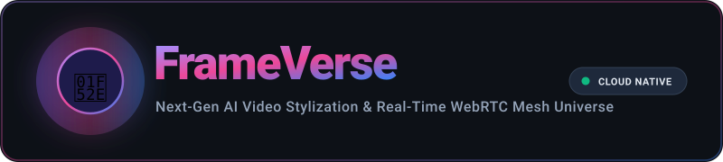
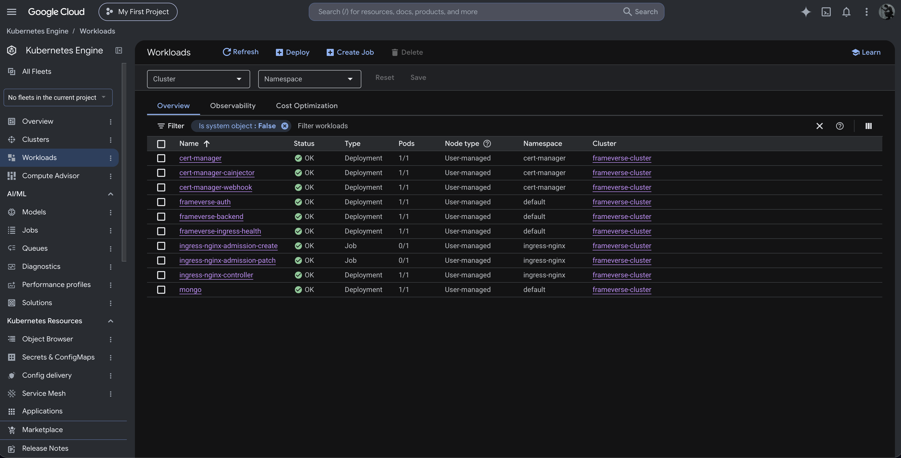
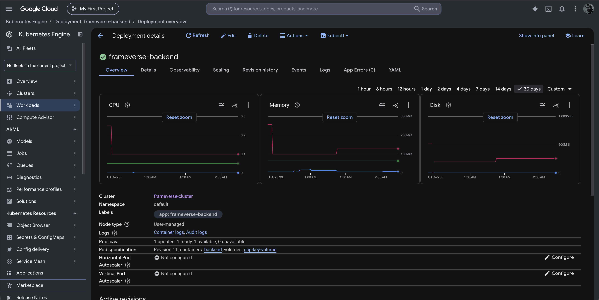

<p align="center">
  
</p>

<p align="center">
  <a href="https://github.com/PratSins/FrameVerse-client"></a>
  <a href="https://github.com/PratSins/FrameVerse-Backend"></a>
  <a href="https://github.com/PratSins/FrameVerse-Auth"></a>
  <a href="https://cloud.google.com/kubernetes-engine"></a>
  <a href="https://letsencrypt.org/"></a>
  <a href="https://firebase.google.com/"></a>
</p>

---

## 🌟 Summary

**FrameVerse** is a production-grade, cloud-native universe uniting **Generative AI Video Stylization** with **Real-Time WebRTC Communications**. Built with an asynchronous microservices architecture orchestrated on **Google Kubernetes Engine (GKE)** and **Firebase Hosting**, the platform delivers low-latency video transformations, driver-level hardware webcam controls, proactive 7-day authentication sessions, and zero-cost automated SSL/TLS termination.

---

## 🔗 The FrameVerse Ecosystem

The FrameVerse codebase is structured across dedicated, single-responsibility repositories:

| Component | Repository Link | Tech Stack | Deployment Target | Description |
| :--- | :--- | :--- | :--- | :--- |
| **Frontend** | [**`FrameVerse-client`**](https://github.com/PratSins/FrameVerse-client) | React 18, TypeScript, Vite, MediaPipe | **Firebase Hosting** (Global CDN) | SPA with gesture tracking, studio preview, and WebRTC video calling. |
| **Core Backend** | [**`FrameVerse-Backend`**](https://github.com/PratSins/FrameVerse-Backend) | Go 1.23, Chi, Gorilla WebSockets, Google Cloud Storage SDK | **GKE Cluster** (`ClusterIP:8080`) | High-concurrency video processing orchestrator & WebRTC signaling hub. |
| **Auth Microservice** | [**`FrameVerse-Auth`**](https://github.com/PratSins/FrameVerse-Auth) | Go 1.23, Chi, pgx/v5, Cloud SQL Postgres, JWT RS256 | **GKE Cluster** (`ClusterIP:8080`) | Stateless JWT issuer, RSA-256 key discovery (JWKS), and user lifecycle manager. |
| **Infrastructure & CI/CD** | *This Repository* (`frameverse`) | Kubernetes Manifests, NGINX Ingress, `cert-manager`, MongoDB | **GKE Cluster** (`frameverse-cluster`) | Consolidated cluster gateway, automated Let's Encrypt TLS, database state, and GitHub Actions CD pipelines. |

> *Note: Cloud infrastructure deployment manifests and automated pipelines are managed directly in this repository.*

---

## 🏛️ System Architecture

```
                                      INTERNET (Web Clients & Browsers)
                                                      │
                            ┌─────────────────────────┴─────────────────────────┐
                            │                                                   │
                  Firebase Hosting Frontend                               Public API & WebSockets
           https://swift-delight-441118-c4.web.app                     https://34.47.229.61.sslip.io
                            │                                                   │
                            └─────────────────────────┬─────────────────────────┘
                                                      │
                                           HTTPS (443) / WSS (WebSockets)
                                                      │
                                                      ▼
                                       GKE External Load Balancer
                                             [34.47.229.61]
                                                      │
                                                      ▼
                                       NGINX Ingress Controller
                                  (Automated TLS via cert-manager)
                                                      │
         ┌────────────────────────────────────────────┼────────────────────────────────────────────┐
         │                                            │                                            │
   /api/v1/auth/*                               /api/v1/toonify/*                              /ws/vchat/*
   /.well-known/jwks.json                       /api/v1/* (REST)                               (WebSocket Upgrade)
         │                                            │                                            │
         ▼                                            ▼                                            ▼
 ┌───────────────┐                            ┌───────────────┐                            ┌───────────────┐
 │frameverse-auth│                            │frameverse-    │                            │frameverse-    │
 │   (Go/GKE)    │                            │backend (Go)   │                            │backend (Go)   │
 └───────┬───────┘                            └───────┬───────┘                            └───────┬───────┘
         │                                            │                                            │
         ▼                                            ▼                                            ▼
 ┌───────────────┐                            ┌───────────────┐                            ┌───────────────┐
 │   Cloud SQL   │                            │ Google Cloud  │                            │  mongo-state  │
 │  (Postgres)   │                            │ Storage (GCS) │                            │(pvc: 10Gi RWO)│
 └───────────────┘                            └───────────────┘                            └───────────────┘
```

---

## 🧩 Deep Dive: Subsystems & Interactions

### 1. Unified API Gateway & Zero-Cost TLS (`cert-manager` + `sslip.io`)
- **The Problem:** Modern browsers enforce strict **Mixed-Content Security**. Because the frontend is hosted over HTTPS on Firebase, any direct API call to plain `http://<IP>` is unconditionally blocked before leaving the browser.
- **The Zero-Cost Solution:**
  1. Utilizes **`sslip.io`** as a wildcard DNS service mapping `34.47.229.61.sslip.io` directly to the GKE Ingress controller without purchasing a domain.
  2. Integrates **`cert-manager`** with a production **Let's Encrypt `ClusterIssuer`**. It handles automated ACME HTTP-01 challenges, signs real X.509 TLS certificates, and hot-reloads NGINX on port 443.
  3. Secures both HTTPS REST calls and secure WebSockets (`wss://`) under one hostname.

### 2. Authentication & JWKS Key Discovery (`FrameVerse-Auth`)
- **Stateless Verification:** When users register or login, `FrameVerse-Auth` generates an asymmetric **RS256 JWT** pair (access token valid for 1 hour, refresh token valid for 7 days).
- **Zero-Latency Backend Verification:** `FrameVerse-Backend` does **not** call the Auth database to check tokens. Instead, it queries the public JWKS endpoint internally over Kubernetes DNS:
  ```
  http://frameverse-auth.default.svc.cluster.local:8080/.well-known/jwks.json
  ```
  Public RSA keys are cached in-memory with automatic expiration, giving near-instant authorization for every API and WebSocket handshake.
- **Proactive Client Keep-Alive:** The frontend runs a background heartbeat that evaluates token expiry and proactively requests a fresh access token 2 minutes prior to expiration, enabling a frictionless 7-day session.

### 3. AI Toonify Studio & Multimodal Pipeline (`FrameVerse-Backend`)
- **Computer Vision Trigger:** Uses client-side **MediaPipe Hand Landmarker** to track hand gestures. Framing your face with both index fingers and thumbs creates a 2-hand "box" that automatically starts recording a video clip with a 3-second countdown.
- **Direct Cloud Upload:** The Go backend generates signed Google Cloud Storage (GCS) upload URLs. Video clips stream directly from the browser to GCS bucket `frameverse-videos`, bypassing backend upload bottlenecks.
- **Vertex AI Video Pipeline:** Once uploaded, the backend initiates an asynchronous job targeting Google Cloud's **Vertex AI Gemini Omni Flash** model (`gemini-omni-flash-preview`). It transforms human camera movements into chosen aesthetic styles (*Anime, Pixar 3D, Cyberpunk*) while enforcing model latency guidelines.
- **Job Polling & Status:** MongoDB stores the job lifecycle (`queued` &rarr; `processing` &rarr; `completed` / `failed`). The frontend polls the backend until the stylized video is ready for side-by-side player compositing.

### 4. Real-Time WebRTC "vChat" Rooms
- **Go WebSocket Hub:** Real-time mesh signaling is handled by a custom Gorilla WebSocket hub in Go, broadcasting SDP offers, answers, and ICE candidates between room participants.
- **Bufferbloat & Stutter Elimination:** 
  - Dynamic video sender bitrate capping (`maxBitrate: 1200000`, 1.2 Mbps) and `degradationPreference: maintain-framerate` prevents home Wi-Fi uplink saturation.
  - Multi-provider STUN candidate pooling (Google, Cloudflare, OpenRelay) guarantees rapid NAT traversal across strict firewalls.
- **Automated ICE Restart:** If network drops or router NAT tables expire, `pc.oniceconnectionstatechange` detects `disconnected` or `failed` states and automatically triggers a seamless **ICE Restart** (`pc.restartIce()`) without disconnecting users.
- **Hardware-Level Camera Toggle:** Clicking "Stop Cam" stops and disconnects the browser's hardware video track at the driver level (turning off the physical green webcam LED). Toggling it on re-requests `getUserMedia` and replaces senders on all active peer connections.

### 5. Persistent MongoDB Storage (`mongo.yaml`)
- Configured as a stateful single-pod deployment on GKE backed by a **10 GiB PersistentVolumeClaim** (`mongo-pvc`) using GCP's `standard-rwo` persistent disk storage class.
- Persists user preferences, Toonify render job histories, and room metadata across pod restarts and rolling updates.

---

## 🖥️ GKE Production Workloads

The entire stack is deployed and actively managed in GKE cluster `frameverse-cluster` (`asia-south1-a`):

<p align="center">
  
  <br>
  <em>Figure 1: Healthy workload status in Google Cloud Console across namespaces (cert-manager, default, ingress-nginx).</em>
</p>

<p align="center">
  
  <br>
  <em>Figure 2: Production rollout overview of frameverse-backend on GKE.</em>
</p>

---

## 🚀 Infrastructure CI/CD Pipelines

This repository hosts **three decoupled GitHub Actions workflows** allowing independent deployments without triggering unrelated services:

```
frameverse/
├── .github/
│   └── workflows/
│       ├── deploy-cert-manager.yml   # Workflow 1: cert-manager Controller & ClusterIssuer
│       ├── deploy-ingress.yml        # Workflow 2: NGINX Ingress Controller & TLS Routing
│       └── deploy-mongo.yml          # Workflow 3: MongoDB PVC, Secret & Deployment
├── deployments/
│   ├── cert-manager-issuer.yaml      # Let's Encrypt Production ClusterIssuer
│   ├── gateway-ingress.yaml          # Unified API Gateway Routing Rules
│   └── mongo.yaml                    # MongoDB Database Manifest
├── docs/                             # Architecture diagrams, logos, and screenshots
└── readme.md
```

### Tag-Triggered Workflows:

| Pipeline | Workflow File | Trigger Tag Pattern | Execution Details |
| :--- | :--- | :--- | :--- |
| **cert-manager** | [`.github/workflows/deploy-cert-manager.yml`](.github/workflows/deploy-cert-manager.yml) | **`cert-*`** (e.g. `cert-v1.0.0`) | Installs `cert-manager` v1.16.3 and registers the `letsencrypt-prod` ACME issuer. |
| **API Gateway Ingress** | [`.github/workflows/deploy-ingress.yml`](.github/workflows/deploy-ingress.yml) | **`v*`** or **`ingress-*`** (e.g. `v1.0.0`) | Applies NGINX Ingress routes, requests TLS cert for `34.47.229.61.sslip.io`, and binds HTTPS port 443. |
| **MongoDB Database** | [`.github/workflows/deploy-mongo.yml`](.github/workflows/deploy-mongo.yml) | **`mongo-*`** (e.g. `mongo-v1.0.0`) | Provisions persistent storage (`mongo-pvc`), deploys MongoDB 8, and binds internal ClusterIP. |

*Note: All three workflows also support manual triggering via `workflow_dispatch` in the GitHub Actions tab.*

---

## 🗺️ Ingress Path Routing Table

All external network traffic enters through the unified ingress endpoint: `https://34.47.229.61.sslip.io`

| Path Prefix | Target Service | Port | Protocol | Purpose |
| :--- | :--- | :--- | :--- | :--- |
| `/healthz` | `frameverse-ingress-health` | `8080` | HTTP/REST | Ingress Gateway Liveness Check (`{"status":"ok","service":"frameverse-ingress"}`) |
| `/api/v1/auth/healthz` | `frameverse-auth` | `8080` | HTTP/REST | Auth Service Liveness Check (`{"status":"ok","service":"frameverse-auth"}`) |
| `/api/v1/backend/healthz` | `frameverse-backend` | `8080` | HTTP/REST | Backend Pipeline Liveness Check (`{"status":"ok","service":"frameverse-backend"}`) |
| `/api/v1/auth/*` | `frameverse-auth` | `8080` | HTTP/REST | User Registration, Login, Token Refresh, Profile Management |
| `/.well-known/jwks.json` | `frameverse-auth` | `8080` | HTTP/REST | Asymmetric Public RSA Key Discovery for JWT Validation |
| `/api/v1/toonify/*` | `frameverse-backend` | `8080` | HTTP/REST | Presigned GCS Upload URLs, Gemini Video Transformation, Job Status |
| `/api/v1/*` | `frameverse-backend` | `8080` | HTTP/REST | Core Backend REST APIs & Room Metadata |
| `/ws/vchat/*` | `frameverse-backend` | `8080` | WebSockets (`wss://`) | Real-Time WebRTC Mesh Signaling Hub |

---

## 🧪 Live Health Check Smoke Tests

Run these terminal commands to verify microservice health and TLS integrity:

```bash
# 1. Ingress Gateway Health Check (HTTPS)
curl -i https://34.47.229.61.sslip.io/healthz

# 2. Auth Service Health Check (HTTPS)
curl -i https://34.47.229.61.sslip.io/api/v1/auth/healthz

# 3. Backend Service Health Check (HTTPS)
curl -i https://34.47.229.61.sslip.io/api/v1/backend/healthz

# 4. Verify Asymmetric JWKS Public Key
curl -i https://34.47.229.61.sslip.io/.well-known/jwks.json

# 5. Inspect TLS Certificate (Issued by Let's Encrypt)
openssl s_client -connect 34.47.229.61:443 -servername 34.47.229.61.sslip.io </dev/null 2>/dev/null | openssl x509 -noout -issuer -subject -dates
```

---

## 🎬 Video & Demo Showcase

Watch the FrameVerse full-stack platform demonstration showcasing AI video transformation, real-time WebRTC multi-peer video meetings, and cloud-native Kubernetes workloads in action:


https://github.com/user-attachments/assets/dd12b311-557a-4b97-842d-3accc3ad194a


<p align="center">
  <video src="docs/Untitled%20design.mp4" controls width="100%" style="max-width: 900px; border-radius: 12px; box-shadow: 0 10px 30px rgba(0,0,0,0.5);">
    Your browser does not support the video tag. You can view the video directly at <a href="docs/Untitled%20design.mp4">docs/Untitled design.mp4</a>.
  </video>
</p>

<p align="center">
  ▶️ <strong><a href="docs/Untitled%20design.mp4">Click to view / download full demo video (<code>Untitled design.mp4</code>)</a></strong>
</p>

---

## 📄 License & Attribution

This project is part of the **FrameVerse** cloud-native ecosystem. Designed and developed by **[Pratyush Singh](https://github.com/PratSins)**.


LinkedIn - https://www.linkedin.com/feed/update/urn:li:activity:7512135912521334784/
